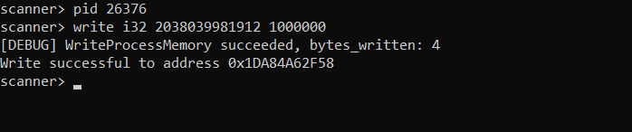

# Memory Scanner CLI

A simple command-line tool to scan and modify memory of running processes on Windows.

## Features

- Scan process memory for specific values (string, i32, f32, i64, f64)
- Rescan previous results for changed values
- Write new values to memory addresses
- Interactive shell interface

## Usage

1. **Build and Run**

`cargo run`

2. **Use commands**

`pid [process_id]` to set target process id
`write [type] [address (hex or decimal)] [value]` to write bytes
`set [type] [value]` to set the target value for scanning
`scan` to start scanning
`rescan` to scan previously found addresses for new value.

Possible types:
`i32, i64, f32, f64, string`

**Screenshot**

